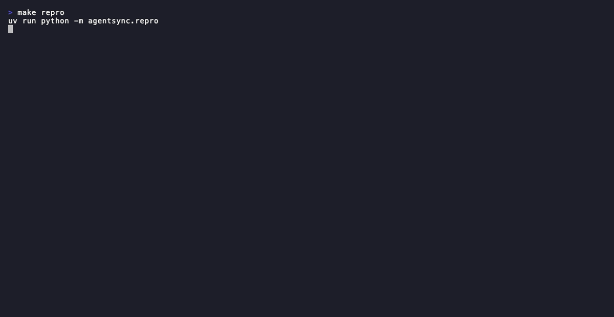

# agentsync

[](https://pypi.org/project/agentsync/)
[](https://github.com/Extodan-Corp/AgentSync/actions/workflows/ci.yml)
[](https://opensource.org/licenses/MIT)
[](https://www.python.org/downloads/)



**Drop-in LangGraph store that merges concurrent agent writes instead of silently dropping them.**

*(Above: `make repro` — the same two-agent graph on stock `InMemoryStore` vs `SyncedStore`. The bug is in vanilla langgraph; the fix is a one-line store swap.)*

When two parallel nodes in a LangGraph graph call `store.put()` on the **same key**, the stock `InMemoryStore` silently overwrites the first write with the second. No error. No merge. No signal — one agent's contribution just disappears. (Verified against langgraph 1.2.6: two parallel `put`s produce two separate `batch()` calls; `InMemoryStore` last-write-wins clobbers the first.)

`agentsync.SyncedStore` is a 1-line swap that fixes this. Concurrent writes to the same key now **merge** — lists union, text concatenates, nested dicts deep-merge — every write is **attributed** to an agent, and a genuine **semantic conflict** (two agents setting the same scalar to different values) is **escalated** instead of silently resolved.

## The swap

```python
from agentsync import SyncedStore                     # 1
store = SyncedStore()                                 # 2
graph = builder.compile(store=store)                  # 3

def my_node(state, store):                            # 4  langgraph injects the store
    with store.acting_as("researcher"):               # 5  attribute your writes
        store.put(("ctx",), "notes", {"tags": [...]}) # 6
```

## Install

```bash
pip install agentsync            # when published; meanwhile:
pip install -e ".[demo]"         # from a clone (or `make setup` with uv)
```

Requires Python 3.10+. Only runtime deps: `langgraph>=1.2,<2` and `loro`.

## Watch it work

```bash
make example   # runs the /examples LangGraph swap demo
```

The same two-agent graph runs on `InMemoryStore` then `SyncedStore`:

```
BASELINE — InMemoryStore
  final value: {'tags': ['benchmark'], 'status': 'published'}
  -> the researcher's tags/findings/status are GONE. No error.

SWAP — SyncedStore
  final value: {'tags': ['agents','benchmark','crdt'], 'status': '<escalated:status>'}

  MERGEABLE WRITES (tags, findings):
    synced   tags : ['agents','benchmark','crdt']   <- both agents preserved
    synced findings: concatenated                   <- both agents preserved

  SEMANTIC CONFLICT (status: 'draft' vs 'published'):
    baseline status: 'published'                    <- silently picked
    synced   status: ESCALATED (not auto-resolved)
      contenders: researcher='draft', writer='published'   <- flagged, attributed

  ATTRIBUTION (per-write, survives the merge):
    tags:researcher:0 -> agent=researcher   tags:writer:0 -> agent=writer
```

## API

| Method | What it does |
|---|---|
| `SyncedStore()` | Drop-in for `InMemoryStore`. Override: zero. |
| `store.acting_as(agent_id)` | Context manager — attribute the puts inside to an agent. |
| `store.on_escalation(cb)` | Register a callback fired when a semantic conflict is detected. |
| `store.escalations()` | List all unresolved conflicts (both contenders attributed). |
| `store.attribution()` | Per-key, per-write attribution map (which agent wrote each field). |

## Honest scope (read this before adopting)

This is the trust pitch, not a disclaimer.

**Where it wins for free.** Mergeable state — concurrent edits to *different* fields, set unions, append logs — is handled structurally with zero model calls. This is the common case for shared agent context (notes, findings, tags), and it's where the silent-write-loss bug bites hardest.

**Where it escalates, not resolves.** When two agents set the same *scalar* to different values, that's a genuine semantic conflict with no correct merge. `SyncedStore` flags it with both contenders attributed and **does not pick a winner**. The field holds an `<escalated:field>` sentinel until you drain the queue.

**Escalate defers both cost *and* correctness.** The cheap thing about escalation is that it does no work — the conflicting field stays divergent. For async knowledge-merge that's free. For an agent that needs to read that field on its next step, escalate = blocked agent: the inference you "saved" reappears downstream, plus a stall. Escalate is the safer *primitive* (you can always bolt a resolver onto `on_escalation`; you can't recover a write LWW silently dropped, and can't un-spend a wrong autonomous repair). It is not a free lunch on time-to-usable-state.

**What it does NOT do.** No shared-codebase editing (code is un-mergeable semantic state). No standalone escalation queue/worker. No auth, multi-tenant, dashboard, or Redis/Postgres backend. Those are gated on real adoption signal.

## Known limitations

Stated plainly, because hiding them is worse than having them:

- **No persistence.** `SyncedStore` is in-memory only — state is lost on process restart. A Redis backend is the obvious next step but is gated on a real team needing it.
- **Escalation blocks a reader.** When a field is escalated it holds an `<escalated:field>` sentinel. An agent that needs to read that field on its next step gets the sentinel, not a usable value — it is effectively blocked until someone drains the escalation. This is the cost of not silently resolving (see *Honest scope*); it's deliberate, not a bug.
- **Single-process, in-memory.** No cross-process replication yet. Two LangGraph processes each holding a `SyncedStore` do not sync with each other.
- **Type mismatch on the same field silently drops a write.** If agent A writes `{"f": ["x"]}` (a list) and agent B writes `{"f": "y"}` (a scalar) to the same key concurrently, one write is dropped **without an escalation** — and which one survives depends on merge order. This is the same silent-corruption failure mode `SyncedStore` prevents for same-type writes; it is a known gap across the type boundary, tracked in `tests/test_adversarial.py`, and intended to escalate in a future version. Same-type concurrent writes (the common case) are not affected.
- **Field "kind" is inferred from value shape, not declared.** Lists union; string values under keys named `*text`/`notes`/`findings`/`log` concatenate; everything else is treated as a scalar (and therefore as a conflict surface). There is no schema declaration API yet.
- **Attribution requires `acting_as`.** Writes made outside a `store.acting_as(...)` block are attributed to `"anonymous"` — attribution completeness then can't be guaranteed.

## The benchmark behind it

`agentsync` shipped as a benchmark before it shipped as a product. `make bench` runs the same workload through three strategies and prints the comparison — the table that proves the bug is real and the fix is honest:

```
workload            strategy       verdict  outcome      writes_lost  escals  model_calls  latency_ms
clean_merge         lww            FAIL     corrupted    3            0       0            ~0.2
clean_merge         transactional  PASS     auto_merged  0            0       0            ~0.2
clean_merge         crdt           PASS     auto_merged  0            0       0            ~1.6
semantic_conflict   lww            FAIL     corrupted    0            0       0            ~0.03
semantic_conflict   transactional  PASS     resolved     0            1       1            ~308
semantic_conflict   crdt           PASS     escalated    0            1       0            ~0.7
```

The `outcome` column is the honesty fix: three PASSes are not the same thing. `resolved` spent a model call to repair and return a usable value; `escalated` spent nothing but left the field divergent; `corrupted` silently dropped a write. Read the full adversarial breakdown in the [Results section below](#benchmark-results).

## How merge decisions are made

| Write type | Merge behavior |
|---|---|
| Lists | Union (order-preserving, deduped) |
| Text (keys named `*text`/`notes`/`findings`/`log`) | Concatenation |
| Nested dicts | Deep-merge |
| Scalars set to the *same* value | Idempotent — no conflict |
| Scalars set to *different* values | **Escalation** (both contenders attributed) |

Merge layer is [Loro](https://loro.dev) (eg-walker family CRDT) — deterministic, coordinator-free convergence. Every write carries an `agent_id` that survives every merge.

## Quick start

```bash
make setup     # uv sync --all-extras (provisions Python 3.12)
make example   # LangGraph swap demo (the landing-page asset)
make bench     # three-way benchmark harness, comparison table
make test      # invariant + integration suite (15 tests)
```

## Benchmark results

Same workload through all three strategies behind one interface.

- **`outcome`** — *how* the strategy reached its end state. Three PASSes are not the same thing. Read it adversarially.
- **`writes_lost`** — the corruption signal. Nonzero on a mergeable workload = silent write drop.

**On genuinely mergeable state (`clean_merge`), CRDT does *not* beat the rival.** `transactional` and `crdt` are a wash: both correct, both 0 model calls, both full attribution. LWW is the only one that fails — it silently drops 3 of the mergeable writes and converges to a *wrong* state.

**The entire differentiated value lives in one cell: `semantic_conflict`.** There, `transactional` is 1 call / ~308 ms and `crdt` is 0 calls / ~0.7 ms. But read the `outcome` column: those are **not the same result**. `transactional` **resolves** (spends the model call, returns a field the next agent can act on). `crdt` **escalates** (flags the divergence, leaves the field divergent). Escalate is cheap precisely because it does not resolve anything — see [Honest scope](#honest-scope-read-this-before-adopting) above for why "800× faster to flag than to resolve" is the correct framing.

**The number that decides the thesis isn't in this repo:** the mergeable-to-semantic conflict ratio in real agent workloads. If real shared-state contention is mostly set unions and append logs, CRDT handles the common case for free and escalates the rare exception. If it's mostly two agents writing the same field with different intent, this is an escalation router. The benchmark can't answer which regime reality is in — only a team running parallel agents can.

## Status

**v0.1.0 (alpha).** `SyncedStore` verified against langgraph 1.2.6; 15 tests green; benchmark + swap demo runnable. Deliberately not built: `agentsync bench --my-workload`, CrewAI adapter, opt-in conflict-ratio telemetry, Redis backend — all gated on real adoption signal.

## Grounding references

- eg-walker — arXiv [2409.14252](https://arxiv.org/abs/2409.14252); `josephg/eg-walker-reference`; `josephg/diamond-types`.
- Loro — [loro.dev](https://loro.dev) (the merge layer this uses).
- Rival benchmarked — CoAgent MTPO, arXiv [2606.15376](https://arxiv.org/abs/2606.15376).
- Boundary case (not a target) — STORM, arXiv [2605.20563](https://arxiv.org/abs/2605.20563).

## License

[MIT](LICENSE)
